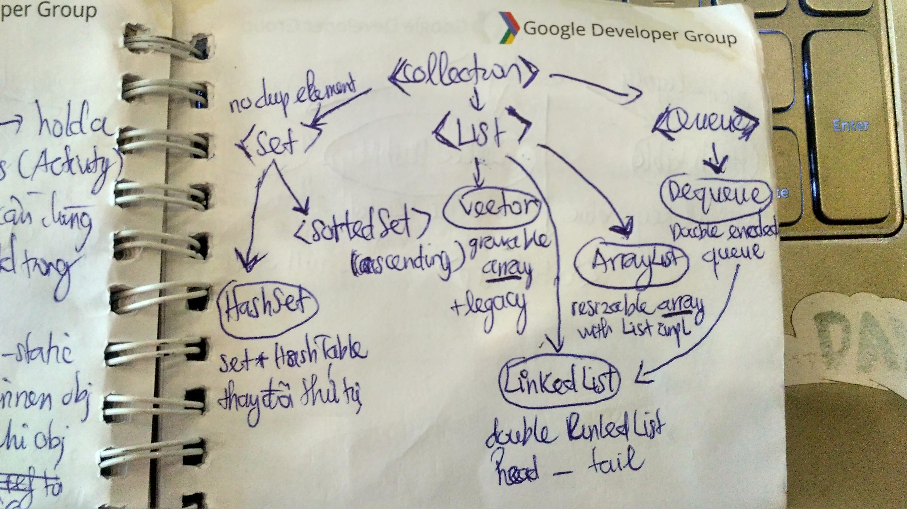
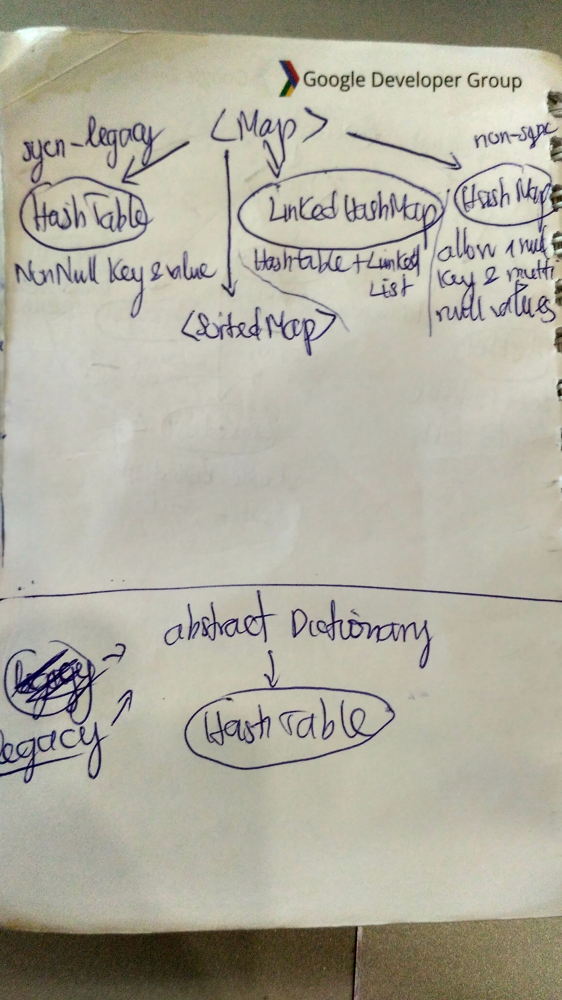

## Android development note

#### Bitmap

* Choose decode method.
* Load a sealed down version to memory.
* Use `LRUCache` to cache bitmaps, keep reference objects using strong reference in `LinkedHashMap`, clear the least used before the cache is full to make room for new bitmaps.
* Use `DiskLRUCache` to cache bitmap on hard disk (avoid load again when process interupted).

#### Process and Thread

* All are execution environment. Process can consist of one or many threads but a thread can only belong to one process.
* Context switching: Store the state of process or thread for resume later. Allow multi process to share a single CPU.
* `AsyncTask` will be execute serially by default on Android API >= 13. Because of that it will block other AsyncTask. To resolve this we use `ThreadpoolExecutor` to execute parallel.

| Process        | Thread          |
| -------------|---------------|
| Heavy weight | Light weight |
| Process creation is costly | Thread creation is economy |
| Not share memory | Memory shared between threads in same process |
| IPC is slow because too many addresses | Communication between threads is fast because they shared mem address |
| Forced to communicate via messages |  |

#### Stack vs Heap in memory

All stored in RAM. But thread have it own stack but share heap.

| Stack        | Heap          |
| -------------|---------------|
| Auto delete memory when variable go out of scope | Remain until collect by program or GC triggerd |
| Fixed [size](https://stackoverflow.com/questions/16843357/what-is-the-android-ui-thread-stack-size-limit-and-how-to-overcome-it) -> cause [StackOverflow](https://stackoverflow.com/questions/214741/what-is-a-stackoverflowerror) | Can get more memory from OS |
| Faster, only need to move pointer to allocate | Slower, synchronize to keep thread safe, complex flow to allocate |
| Attach to thread, when thread stop -> reclaim | Attach to app process, process exit -> reclaim |
| Store local data, return data, params address, primitive variables | Store block of data, all object instance, static variable (Perm Gen) |
| Fixed [size](https://stackoverflow.com/questions/16843357/what-is-the-android-ui-thread-stack-size-limit-and-how-to-overcome-it) vary by Android API | Max 64Mb default in Java, max Android heap size vary by device's screen size |
| Cause StackOverflow | Cause memory fragmentation, memory leaks, MaxHeapException, OutOfMemoryError |

#### Android heap

Android heap contain Java heap, native heap and ashmem.

Android limit heap size per process.
Max heap size is vary by screen resolution. Bigger screen -> bigger graphics/bitmaps -> need more heap.

`OutOfMemory` error mostly cause from bitmaps, leak memory that GC cannot free. Enable hardware accelerate (allow draw canvas using GPU) will consume more RAM memory.

* `getRuntime().maxMemory()` is total bytes of heap that our app is **allowed** to use.
* `ActivityManager.getMemoryClass()` is total MB of heap that our app **should** use to respect limit of device.
* Read `heapstartsize`, `heapgrowlimit`, `heapsize` information inside `system/build.prop` file.
* Put `android:largeHeap="true"` in `AndroidManifest.xml` let the heap grow from `heapgrowlimit` to `heapsize` (Android API >= 11). But no guarantee.
* Request native heap using NDK JNI.

#### Java heap

| Eden  | S0   | S1      |  Old Gen | Perm Gen |
| -------|-------| ------- | ------- | ------- |
|        |       |         | Major GC |        |

#### Ashmem (ashmem.c)

* Share memory between process using memory maps by name (auto clean).
* Better support low-mem devices because it can discard shared mem unit under memory pressure.
* Removed in Android 5.0 and higher.
* Using C.

#### Memory leaks

* **Unregister listener**

* **Non-static nested class (inner class)**

  Inner class hold a strong implicit reference to outer enclosing class.
  -> Use static nested class, send objects that needed from instance of outer class through constructor and hold inside `<WeakReference>`.

* **Anonymous Class**
  Also an inner class. It usually cause memory leaks by an object have reference to this anonymous class without any information about it's outer container object, when the outer container object not use anymore, but the anonymous class still alive (because of still have a reference from outside) then this anonymous class and entire outer container object leaks and cannot be GC.

* **Bitmap**
  -> Remember to `setBackgroundResource(null)` and `recycle()` bitmaps after use.

* **Context**
  Can leak entire Activity + view tree when device roration.
  -> Avoid static context, use `getApplicationContext()` for long-live object.

* **Resource not closed**

#### How to increase Android App Performance?

* **Avoid slow rendering**:
  System draw app's screen after every 1000/60FPS = `16.7ms`. If our app CANNOT complete logic in `16.7ms` it will force system to **drop frame** which called a jank. 
  To avoid it we can: use [Layout Inspector](https://developer.android.com/studio/debug/layout-inspector.html), [profile GPU rendering](https://developer.android.com/topic/performance/rendering/profile-gpu.html), use `ConstrainLayout` to reduce nested layout, move `onMeasure`, `onLayout` to background thread, use `match_parent`. 
  Long-running task should run asynchronous outside UI thread.
  Avoid nested `RecyclerView`, avoid call `notifyDatasetChanged()` in RV adapter with small update. Use [RV Prefetch](https://medium.com/google-developers/recyclerview-prefetch-c2f269075710) to reduce the cost of inflation in most case by doing the work ahead of time, while UI thread is idle. RV `onBindViewHolder()` called on UI thread -> it should be very simple, and take much less than one millisecond for all but the most complex items, it should only get data from POJO and update ui.

* **App lauching time**:
  We can reduce app lauching time by: Lazy load resources. Allow app to load and display views first, then update visual which depend on bitmap and other resources.

* **Layout**:
  Optimize layout hierachy to avoid nested `LinearLayout` that use `layout_weight` or nested `RelativeLayout`. Reuse layout using `<include>` or `<merge>`. Use dynamic views with views rarely use. Use `RecyclerView` instead of the old `ListView`. Apply `ViewHolder` pattern for lists. Use `lint` tool to check layouts.

* **Power usage**:
  Reduce network call. Avoid [wake lock](https://developer.android.com/training/scheduling/wakelock.html). Use GPS and `AlarmManager` carefully. Perform batch scheduling.

* **Avoid using enum**
  Enum cause bigger apk size, 4 byte reference + enum size.
  -> Use constants or [IntDef](https://stackoverflow.com/questions/32032503/enums-and-android-annotation-intdef) instead.

## Serializable vs Parcelable

| Serializable        | Parcelable          |
| -------------|---------------|
| Only a marker interface | Provide skeleton to implement |
| Serialize object into stream of byte (`writeObject()`) | Write to `Parcel` container |
| Deserialize use no-arg constructor (`readObject()`) | Use `Parcelable.CREATOR` to generate instance and read data from `Parcel` |
| Use Java reflection and use `serialVersionUid` to detect and build object instance | Use `IBinder`, high IPC transport |
| Slower | Faster (x10) |
| Create alot of temp object -> cause GC run many times |  |
| Easy to apply | Need effort to implement |

#### Why Android use virtual machine

* Code isolate from the core OS -> code contain malicious won't affect system directly. Make app and system stable and reliable.
* Cross platform compatibility, platform independent.

#### Java Virtual Machine

Java code use JVM compiler (`javac`) to compile Java code (`.java`) into Java bytecode (`.class`). On runtime environment (Web, PC,..) Java interpreter convert bytecode into machine specs instruction set by: Start JVM -> Run (Start main thread, link, load `.class` files, execute machine code, unload classes, terminate main thread) -> Shutdown JVM.

* Modern JVM use just-in-time (JIT) compilation to compile the bytecode to machine code on the fly at runtime.
* It's possible to compile Java code down to native code ahead of time, then run.
* It's also possible to intepret Java code directly.

#### Dalvik Virtual Machine

DVM is Android virtual machine which is optimized for mobile (memory, battery life, performance,..)

#### JVM vs DVM

| JVM        | DVM          |
| -------------|---------------|
| Not free | Free |
| Use `.class` bytecode | Convert `.class` bytecode to `.dex` bytecode using dex compiler |
| Stack based | Register based |

#### How to build an APK

`javac` compile `R.java` + `aidl` files + Android Java classes to Java `.class` bytecode. Then use `dx` tool to convert them to `.dex` bytecode. Then `aapt` packaging compile resources into binary assets and put to `APK Packager`. `APK packager` use bytecode, resources and signed keystore to build APK.

#### Android Runtime vs Dalvik Virtual Machine

| ART        | DVM          |
| -------------|---------------|
| Ahead-of-time compile together with JIT (Android 7.0) with code profiling | Just-in-time compile |
| Replace Dalvik from Android 5.0 (Introduced from 4.4) |  |
| Faster, reduce start up time (because of AOT) |  |
| Take time and storage space to translate `.dex` file during install | No extra installation time and storage space |
| Use `dex2oat` to generate `.oat` native code from `.dex` bytecode | Use `dex opt` to convert `.dex` bytecode to `.odex` bytecode |
| Improve battery life |  |
| Improve GC |  |

#### Just-in-time vs Ahead-of-time

| JIT        | AOT          |
| -------------|---------------|
| **Dynamic** translate **part** of bytecode to machine code and **cache in memory** when app run | Statically translate bytecode to machine code at **installation** time and **store in storage** |
| Small memory | One time event, code execute faster but need extra space and time |

#### Android main components

* **Context**
  Abstract class to implement, support access to app resources, lauch activity/service/broadcast receiver. 
  Provide context of current state of app environment data.

* **Activity**
  Main control unit. Provide UI for user to interact. Which included `Window` - carrier and `View`s - display.

* **Service**
  Long-running operation in background (can be in UI thread or worker thread), no UI and user interact.

* **BroadcastReceiver**
  Enable system to deliver events to the app and the OS (outside user's flow) or communicate between components.

* **ContentProvider**
  Manage set of shared data in system. Share and access data of other app. Use `ContentResolver` to resolve `URI` to specific content provider.

* **Intent**
  Message object to request action.

* **Handler**
  Schedule `Message` and `Runable` to be execute at some point or enqueue action to perform in different thread. Main part of `HandlerThread` - a thread that has a looper.

* **aidl**
  To generate IPC code. 

#### Android Service

* Only one instance of specific service is allow to run at the same time.
* Use `bindService()` when need to communicate between activity and service (thru service connection).
* `START_STICKY` explicit started and stop aas needed, `START_NOT_STICKY` tell OS not to re-start service again when have enough memory (when service was killed before due to device run out of memory)

| Service        | IntentService          |
| -------------|---------------|
| Main thread | New worker thread | 
| Block main thread | Cannot run task in parallel |
| Must call `stopSelf()` or `stopService()` | Do not have to call, auto shutdown when job done |

#### Race condition

A race condition occurs when two or more threads can access shared data and they try to change it at the same time. The shared data part is called "critical section".
To resolve conflict, race condition Java sync is NOT enough -> blocking thread.

* `vilotile`: Ensure anythread that read a field will see the most recently value.

| synchronize        | lock          |
| -------------|---------------|
| Java use monitor lock | Need help of system |
| Easy to use | Need to try/catch exception to **release** the lock |

#### Java collections

* **Java Collections overview**

* **Java Collections abstraction**

* **Map and Dictionary**

#### Enumerator vs Iterator

| Enumerator        | Iterator          |
| -------------|---------------|
|  | have `remove()` |
| From Java 1.0 | From Java 1.2 |
| Legacy to support `HashTable`, `Stack`, `Vector` | New |
| Fail safe | Fail fast -> thread safe, secure |

#### HashTable vs HashMap

| HashTable        | HashMap          |
| -------------|---------------|
| Legacy | New |
| NonNull | New |
| Synchronize | Non-sync | 

#### Vector vs ArrayList

| Vector        | ArrayList          |
| -------------|---------------|
| Legacy/Deprecated | New |
| Synchronize invidual operation, not the whole sequence operations | Non-sync |
| Data growth | Data expand |